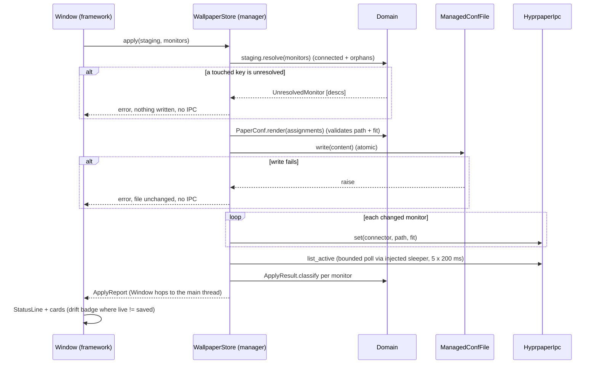

# backdrop — desktop background manager (v1 design)

**Status:** design, not implemented. Written 2026-09-24.
**App:** `apps/backdrop/`, namespace `Backdrop`, entry point `bin/backdrop`.
**Closest sibling:** `apps/hypr-manager/`. Like it, backdrop is a user-owned
config writer with no sudo path.

The name stays `backdrop`. It is short, says what it manages, and does not
collide with `hyprpaper`, the daemon it drives.

## 1. What v1 does

A picker that sets a wallpaper per monitor.

- Shows the connected monitors as cards drawn in their rotated shape.
- Browses images from library folders the user adds and removes in the app.
- Stages an image onto one monitor or onto all of them. Each card previews
  how `cover` crops the staged image.
- Warns on an orientation mismatch (landscape image on a portrait monitor,
  or the reverse).
- Badges images that `cover` would upscale on the target monitor.
- **Apply** writes the managed file, so the choice persists, and switches
  the live wallpaper over hyprpaper IPC. Then it verifies the switch.
- Refreshes when monitors change (hotplug, or a rotation applied by
  hypr-manager).

Monitor size and rotation are **read, never set**. hypr-manager owns them.

**Deferred:** orientation pairs (one landscape and one portrait image as a
single wallpaper, swapped on rotation), and slideshows (hyprpaper's
`timeout`/`order`/`recursive` keys). Fit modes other than `cover` are also
deferred in the UI (see §4.2).

## 2. Verified hyprpaper facts that shape the design

All measured on this machine on 2026-09-24, against hyprpaper 0.8.4, two
3840x2160 Dell P2721Q panels (HDMI-A-1 at transform 1, DP-2 at transform 0).
Every live test restarted the daemon afterwards and confirmed
`listactive` matched the original state.

Items marked **corrects the brief** contradict the facts the design was
commissioned with.

| # | Fact | Consequence |
|---|------|-------------|
| F1 | A **config-file** `monitor = desc:…` block shadows **every** IPC switch for that monitor, whether by connector or by `desc:`. Both return rc 0, and `listactive` never changes. Priority is `desc:` > connector > catch-all, whatever the block order. **Corrects the brief:** "write `desc:`, switch by connector" cannot work. | The managed file keys blocks by **connector**. The existing `desc:` block in `hyprpaper.conf` must move into the managed file (§5). |
| F2 | An **IPC** `desc:` call is not a harmless no-op. It can register a desc-keyed target that silently shadows later connector calls for that monitor until the daemon restarts. This wedged the live daemon during testing. **Corrects the brief.** | backdrop never sends `desc:` over IPC. The adapter rejects it. |
| F3 | A config connector block can be replaced over IPC, repeatedly. | A live switch works for every monitor the managed file keys by connector. |
| F4 | **rc 0 does not prove a switch.** `fit_mode=bogus` returns rc 0. So do shadowed calls. | Every Apply verifies with `listactive`. The domain validates `fit_mode`. |
| F5 | rc 1 cases: `error: bad path: <p>`, `error: failed to set wallpaper: Invalid monitor`, and `error: can't send: failed to connect to hyprpaper (is it running?)` when the daemon or socket is gone. | The adapter maps these to typed failures (§4.3). |
| F6 | A comma in the image path is split as the IPC field delimiter (rc 1, bad path). Spaces are fine. | `ImagePath` rejects `,`. It also rejects `#` (hyprlang comment), newlines, and relative paths. |
| F7 | IPC verbs in 0.8.4 are only `wallpaper` and `listactive`. | No reload. The live switch is one `wallpaper` call per monitor. |
| F8 | Same-priority blocks: the **last parsed wins**. `source =` position matters. | The `source` line goes at the **end** of `hyprpaper.conf`. |
| F9 | `source =` of a missing file exits 1, which blanks the desktop. An empty or comment-only file is fine, and `~` expands. **A wildcard glob exits 1 even when it matches** (the log says "glob matched 1 file(s)", then fails). | The glob-plus-committed-placeholder approach is out. The file's existence is guaranteed at launch (§5). |
| F10 | A malformed sourced file, or a missing image path, is logged and is **not** fatal. | A bad write degrades one monitor. It does not blank the desktop. The writer is still atomic. |
| F11 | `hyprctl --instance <bad> monitors -j` prints `instance invalid` with **rc 0**. (`hyprctl --instance <bad> hyprpaper listactive` prints the same text but exits 1.) Today `HyprlandIpc.monitors` would parse-fail and return `[]`, reporting "no monitors" for "wrong instance". | The strict query treats unparseable output as an error (§4.3, U2). |
| F12 | `hyprctl instances -j` lists live instances with their `wl_socket`. `hyprctl --instance <sig>` targets one explicitly, and that includes `hyprctl … hyprpaper`. | Stale-signature fix: pick the instance whose `wl_socket` equals the app's own `WAYLAND_DISPLAY` (§4.3). |
| F13 | A second foreground `hyprpaper` deletes the live `.hyprpaper.sock` on exit. | Tests never spawn hyprpaper. Live verification is manual, with a restart (§8.4). |

Isolated probe for fatal-exit checks (it cannot reach the live socket, and
it never opens its own IPC socket, so it cannot answer `listactive`):
`XDG_RUNTIME_DIR=<scratch> WAYLAND_DISPLAY=/run/user/1000/wayland-1 hyprpaper -c <cfg>`.

## 3. Files and the single source of truth

| File | Owner | Holds | Why here |
|------|-------|-------|----------|
| `~/hyprpaper.local.conf` | backdrop, **whole file** | Wallpaper assignments: one `wallpaper {}` block per monitor | hyprpaper must read assignments from a config file anyway. Keeping them only here means no second copy can drift. Same machine-local-override pattern as `~/hyprland.local.conf`, and outside the dotfiles repo. |
| `$XDG_CONFIG_HOME/backdrop/settings.json` (default `~/.config/backdrop/`) | backdrop | Library folder list only | App preference that hyprpaper never reads. XDG is the conventional home. |
| `~/.local/state/backdrop/hyprpaper.local.conf.bak` | backdrop | Copy taken before the first write of a session | Mirrors hypr-manager's backup. |
| `~/dev/custom/hypr/hyprpaper.conf` | owner (dotfiles) | Default catch-all, plus `source = ~/hyprpaper.local.conf` at the end | backdrop reads it **read-only**, only to check the `source` line exists (§4.2 `SourceCheck`). Never written. |

**Decision: assignments are derived back from the managed file, not stored
in JSON.** An XDG JSON copy of the assignments would be a second home for
the same fact. A hand-edit of the conf, or a crash between the two writes,
would make them disagree. hypr-manager already derives its state from the
conf it writes, so this matches the precedent. Library folders are the one
fact hyprpaper does not need, so they alone go to XDG.

### 3.1 Managed file format

```
# Managed by backdrop. Apply rewrites this whole file.
# Blocks are keyed by connector, not desc: hyprpaper 0.8.4 ignores IPC
# switches for any monitor a desc: block targets.

# desc: Dell Inc. DELL P2721Q GPCZGH3
wallpaper {
    monitor = HDMI-A-1
    path = /home/cjpoll/Pictures/cyberpunk-rotated.jpg
    fit_mode = cover
}
```

- The `# desc: <description>` line before each block is **load-bearing**. It
  records the panel's stable identity (EDID description) next to the
  connector hyprpaper needs. The parser pairs the comment with the block
  that follows it.
- Blocks are rendered sorted by connector, so output is deterministic.
- No catch-all block (empty `monitor`). **Set on all** writes one explicit
  block per connected monitor. The owner's catch-all in `hyprpaper.conf`
  stays the default for monitors backdrop has never assigned, including a
  newly plugged one.
- An empty assignment set renders the header only. That was verified valid
  (F9).
- A displaced orphan (§4.2 `Staging`) renders as one inert comment line,
  `# orphan desc=<description> connector=<connector> fit=<mode> path=<path>`,
  with `path` last because paths may contain spaces. `parse` reads it back
  into `Staging`, so the panel's choice survives until it is reconnected
  and applied.

## 4. Modules, bucket by bucket

The layout mirrors hypr-manager. `Window` is the framework/controller
layer: it owns edit state and binds UI callbacks to manager calls. UI
components never call managers or adapters.

### 4.1 Shared code promoted to `lib/` (a second app now needs it)

| Module | Bucket | Change |
|--------|--------|--------|
| `Compositor::Domain::Monitor` (`lib/compositor/domain/monitor.rb`) | Domain | **Moved** from `HyprManager::Domain::Monitor`, unchanged. hypr-manager references the new constant. (U1) |
| `Compositor::Domain::InstanceChoice` (`lib/compositor/domain/instance_choice.rb`) | Domain | New. `pick(instances, wayland_display:)` returns a signature. It raises `InstanceError` subclasses, each naming the key it searched for and the candidates it saw: `MissingKey` when `wayland_display` is nil or empty (a resolution failure, never "no match"), `NoInstance` when nothing matches, `AmbiguousInstance` when more than one does. Both sides are compared by `File.basename`, so `wayland-1` and `/run/user/1000/wayland-1` match. (U2) |
| `Compositor::Adapters::HyprlandInstance` | Side effect | New. Runs `hyprctl instances -j` and raises `InstanceError` on a non-zero exit or unparseable output, before `pick` ever sees a list. Then calls `InstanceChoice.pick` with `ENV['WAYLAND_DISPLAY']`. The result, or the error, is memoized on the instance (a module-level default instance serves production callers), so tests build fresh instances and never depend on run order. `resolve!` raises. `resolve` returns `nil` and warns once with the error's message, for lenient callers. The command runner is injectable for tests. (U2) |
| `Compositor::Adapters::HyprlandIpc` | Side effect | Every call passes `--instance <sig>` when `HyprlandInstance.resolve` returns one. The command runner is injectable. New `monitors!` calls `resolve!`, and raises `HyprlandIpc::Error` on a non-zero exit, on unparseable output (F11: `instance invalid` with rc 0), or on an empty list (a running compositor always has a monitor). **The lenient methods keep today's contract exactly:** `monitors`, `workspaces` and `active_workspace` never raise. When resolution fails they fall back to the inherited environment, as today. Every failure warns with the instance and command it used. The bar's timers are therefore unaffected by U2. Migrating them to strict calls is the §9 follow-up. (U2) |
| `Compositor::Adapters::HyprlandEvents` | Side effect | `new(socket_path: nil, dispatch: ->(&b) { GLib::Idle.add { b.call; false } })`: an injected path is used as-is, and tests inject an immediate `dispatch`, so they need no GLib main context. Otherwise it resolves the socket path through `HyprlandInstance.resolve`, falling back to the env var as today when that returns `nil`, so `start` never raises. Adds `on_closed { |reason| }`. It fires once on a clean EOF (`reason: :eof`), on an exception (`reason:` the message), or when `start` finds no socket path, and is always delivered through `dispatch`, which defaults to the main loop. Today a clean EOF ends silently. (U2) |

### 4.2 `Backdrop::Domain` — pure, no GTK, no IO

| Module | Responsibility |
|--------|----------------|
| `Assignment` | `Struct(:connector, :description, :path, :fit_mode)`. |
| `FitMode` | `VALID = %w[contain cover tile fill]`. `validate!(mode)` raises on anything else (F4). |
| `ImagePath` | `validate!(path)`: absolute, and no `,` (F6), no `#`, no newline. Returns the path or raises `InvalidPath` with the offending character named. |
| `ImageFile` | `Struct(:path, :width, :height)` plus `orientation` (`:landscape`, `:portrait`, `:square`). |
| `Fit` | `pixel_size(monitor)`: physical `[w, h]` after rotation (axes swapped on odd transform, no scale). `cover_scale(image, monitor)` is `max(W/w, H/h)`. `upscaled?` is true when `cover_scale > 1.0`: this is the "below resolution" badge. `orientation_mismatch?` compares a landscape/portrait image with a portrait/landscape monitor; square never mismatches. `crop_fraction`: share of the image `cover` discards, shown as "crops 44%". |
| `PaperConf` | `parse(content)` returns `Parsed(assignments:, issues:)` and never raises on user content. Issues are a `desc:`-keyed block, a catch-all block, an unknown key, an unclosed block, or a block with no `# desc:` comment. The last is a note, not an error: identity then comes from the live connector. `render(resolved)` returns the whole file (§3.1), active blocks plus orphan comment records, and validates every path and fit mode first. **Issue blocks are not assignments.** They never enter `Staging`, so `render` never writes a `desc:` or catch-all block back. Apply's report names each issue block it removed. |
| `SourceCheck` | `sourced?(hyprpaper_conf, managed_path)` checks for an active `source =` line naming the managed file (`~` or absolute form). A missing line makes Apply's persistence a mechanism that writes but nothing reads, so the UI warns. |
| `ActiveWallpapers` | `parse(listactive_output)` returns `{connector => path}`, splitting each line on the **first** `": "`. It raises `Malformed` on output starting with `error:`, on any non-blank line without `": "`, or on a line with an empty connector or path. Plain text such as `instance invalid` therefore raises instead of reading as "nothing active". Empty output is `{}`, the one legitimate "nothing active". |
| `LibrarySettings` | Ordered folder list. `add(path)` expands, requires absolute, and dedupes. `remove(path)`. `to_h` / `from_h` with `version: 1`. `from_h` on an unknown version raises instead of guessing. |
| `Staging` | The **full desired file contents**, not a diff. `Staging.from_saved(assignments)` seeds it with every saved assignment, orphans included. That set is also the `revert` baseline. Entries are keyed by `MonitorKey`: the description when the block recorded one, otherwise `connector:<name>`, so two description-less blocks never collide. Methods: `stage(descriptions, path)`, `stage_all(monitors, path)`, `remap(description, new_connector)` (used for `moved_from`), `revert`, `dirty?` (desired ≠ baseline), `staged_for(key)`, and `touched` (keys the user staged this session). `resolve(monitors)` returns the connector-keyed `Assignment`s to render: each connected entry gets the connector it is currently on, and orphans pass through with their recorded connector. **A connected entry wins any connector collision.** An orphan whose recorded connector is now used by a connected entry is *displaced*: it is kept as an `OrphanRecord`, which renders as an inert comment line and targets no monitor. A non-colliding orphan keeps its active block, so replugging the same panel into the same port restores its wallpaper with no app running. `resolve` returns `Resolved(assignments:, displaced:)`. It raises `UnresolvedMonitor` only when a key in `touched` is not connected, and the error names **every** such key. An orphan the user never touched is never an error, and is never dropped. |
| `Reconciliation` | `call(assignments, monitors, live)` returns one `MonitorState` per connected monitor, plus `orphans`. States: `saved`, `live` (`nil` when hyprpaper is unreachable, which means *unknown*, not *differs*), `drift?` (live known and different from saved), and `moved_from` (the recorded description now sits on another connector). Orphans are saved assignments whose description is not connected. They are kept in the file, and the status line counts and names them. |
| `ApplyResult` | `Struct(:connector, :status, :reason, :expected, :actual, :text)`. `status` is `:applied`, `:ipc_failed`, `:unverified` (live read and it differs), or `:unconfirmed` (live could not be read during verification, so the outcome is unknown, never assumed applied). `reason` (for `:ipc_failed` and `:unconfirmed`) is `:daemon_down`, `:bad_path`, `:invalid_monitor`, `:error` or `:other`, and `text` holds the raw hyprctl output. `ApplyResult.classify(outcome, expected:, actual:)` builds one. `ApplyReport` = `Struct(:saved, :results, :warnings)`. Its `summary` produces the status text and always says whether the file was saved. |

### 4.3 Side effects

| Module | Responsibility |
|--------|----------------|
| `Backdrop::Adapters::ManagedConfFile` | `new(path: DEFAULT_PATH, backup_path: DEFAULT_BACKUP)`, with `DEFAULT_PATH = ~/hyprpaper.local.conf` and `DEFAULT_BACKUP = ~/.local/state/backdrop/hyprpaper.local.conf.bak`. Both are constructor arguments so tests use a tmpdir. `read` returns `nil` when the file is **missing** and `""` when it is empty; the two are kept distinct. `write(content)` backs up once per instance, writes a temp file in the same dir, fsyncs, then renames. `ensure_exists` creates an empty file if missing. |
| `Backdrop::Adapters::SettingsFile` | Reads and writes `settings.json` atomically. The base directory is a constructor argument, so tests never mutate `ENV`. A missing file returns defaults. Malformed JSON raises `SettingsFile::Corrupt`, which the UI shows. It never overwrites a file it could not parse. |
| `Backdrop::Adapters::HyprpaperConfFile` | Read-only. `new(path: File.expand_path('~/.config/hypr/hyprpaper.conf'))`. That is the path hyprpaper itself reads; it is a symlink to `~/dev/custom/hypr/hyprpaper.conf`. `read` returns `nil` when the file is missing, so the StatusLine can say "hyprpaper.conf not found" rather than the misleading "not sourced". |
| `Backdrop::Adapters::HyprpaperIpc` | `set(connector, path, fit_mode)` runs `hyprctl --instance <sig> hyprpaper wallpaper "<c>,<p>,<f>"` as an argv array (no shell), with `<sig>` from `HyprlandInstance.resolve!`. It raises `ArgumentError` on a `desc:` connector (F2). Returns `IpcOutcome(ok:, text:)`. `list_active` returns the raw stdout. It raises `HyprpaperIpc::Unreachable` when output matches `failed to connect to hyprpaper`, and `HyprpaperIpc::Error` on any other non-zero exit (for example `instance invalid`, which `listactive` exits 1 on, unlike `monitors -j`). The command runner is injectable. |
| `Backdrop::Adapters::ImageLibrary` | `scan(folder)` returns `ScanResult(folder:, images:, error:)`. Non-recursive. Extensions `.png .jpg .jpeg`, case-insensitive (the two formats verified on this machine). Dimensions come from `GdkPixbuf::Pixbuf.get_file_info` (header only, no decode). A missing or unreadable folder is `error: "not found: <path>"`, never an empty list. An unreadable image is listed with `error:` set. |

### 4.4 Managers

| Module | Responsibility |
|--------|----------------|
| `Backdrop::Managers::WallpaperStore` | `load` runs the startup flow (§6.2) and returns a `Snapshot(monitors:, assignments:, live:, states:, orphans:, issues:, sourced:)`. `refresh(snapshot)` re-reads monitors and live state and reconciles (§6.3), returning a new `Snapshot`. `apply(staging, monitors)` runs the apply flow (§6.1). It raises only **before the write**: `Staging::UnresolvedMonitor`, `PaperConf::InvalidAssignment` (path or fit), `ManagedConfFile::WriteError`. Once the write succeeds it **always returns** an `ApplyReport(saved: true, …)`. Every IPC, instance-resolution or verification error after that point becomes a per-monitor `:ipc_failed` or `:unconfirmed` result, never an exception. The report also carries `resolved.displaced` and the removed issue blocks as warnings. `watch(on_change:, on_closed:)` owns the `HyprlandEvents` instance, so `Window` never touches an adapter. Adapters and a `sleeper:` (default `->(s) { sleep(s) }`, a no-op lambda in tests) are injected through the constructor. |
| `Backdrop::Managers::Library` | `load` reads settings and scans each folder. `add_folder` / `remove_folder` save settings and rescan. Returns `[ScanResult]`. |

### 4.5 UI (`Backdrop::UI`, presentation only)

| Component | Contract |
|-----------|----------|
| `MonitorCard` | `new(state, staged:, on_set_here:)`. A preview box sized `Fit.pixel_size / PREVIEW_SCALE`, so a portrait panel draws tall. Inside it, a `Gtk::Picture` with `content_fit = :cover` shows the staged image, or the live one. That is GTK's own cover crop, so the preview matches hyprpaper's centered cover. Badges: orientation mismatch, `upscaled ×1.4`, `crops 44%`, drift ("live differs from saved"), `moved from DP-3`. Header shows the connector and short description. A **Set here** button calls `on_set_here.(description)`. |
| `ImageGrid` | `new(scan_results, selected:, target_monitors:, on_select:)`. A `Gtk::FlowBox` of `ImageTile`s grouped by folder. A folder with an error renders an error row, not an empty section. **Noted bucket exception:** thumbnails are decoded inside this component (`GdkPixbuf::Pixbuf.new(file:, width:, height:)` at tile size). The repo rule says adapters return no GTK objects, and a texture is only useful to GTK. The decode runs on one worker thread fed by a queue, and each finished texture is handed to its tile through `GtkKit::Timers#on_main_thread`, so the main loop never waits on a 4K decode. Nothing decoded leaves the widget. |
| `ImageTile` | Thumbnail and file name, plus badges computed against `target_monitors` (the selected monitor, or every monitor for **Set on all**). |
| `FolderList` | `new(folders, on_add:, on_remove:)`. Add opens a `Gtk::FileDialog#select_folder`. The chosen path is passed up. |
| `StatusLine` | Renders the latest `ApplyReport#summary` (or the worker's error), load issues, orphan count, the `SourceCheck` warning, and "not watching monitor changes" when events close. |

### 4.6 Framework

- `apps/backdrop/main.rb`: Zeitwerk roots for `lib/` and `apps/backdrop/`, with the `ui => UI` inflection. It is not a layer-shell client.
- `apps/backdrop/application.rb`: `Backdrop::Application < GtkKit::Application`, re-activation presents the existing window (copy hypr-manager).
- `apps/backdrop/window.rb`: owns `Snapshot`, `Staging`, the selected image, and the scan results. It binds UI callbacks to `WallpaperStore` and `Library`. The action bar has **Set on all**, **Revert** and **Apply**, and Apply is sensitive only when `dirty?` and no apply is running. Apply runs `WallpaperStore#apply` on a worker thread, because verification sleeps (§6.1). The worker gets a **frozen copy** of `Staging`, since Set here stays live on the main thread. The worker body rescues `StandardError` and hands either the report or the error to the main thread through `on_main_thread`. An `ensure` clears the running flag, so a failure can never leave Apply disabled. When a report with `saved: true` arrives, `Window` rebuilds `Staging` with `from_saved` from what was written, which resets `dirty?` and `touched`. Monitor changes arrive through `WallpaperStore#watch` (§6.3). After every `load` or `refresh`, `Window` applies each `moved_from` state to `Staging` with `remap`.
- `apps/backdrop/assets/backdrop.css`: layered over `assets/base.css`.
- `bin/backdrop`: same wrapper as `bin/hypr-manager`, plus the `logs/<app>.log` redirect that `bin/bar` has.

## 5. Paired change in `~/dev/custom` (U3)

Required by F1, F8 and F9. It is a separate commit in the dotfiles repo, in
this order:

1. **Seed `~/hyprpaper.local.conf` first.** Content: the header plus the
   HDMI block, re-keyed from `desc:Dell Inc. DELL P2721Q GPCZGH3` to
   `monitor = HDMI-A-1` with the `# desc:` comment (§3.1). The file must
   exist before step 2 takes effect, because `~/.config/hypr/hyprpaper.conf`
   is a symlink into the repo and is live the moment it is saved.
2. `hyprpaper.conf`: delete the `desc:` HDMI block (F1: it would shadow both
   the managed block and every live switch). Keep the catch-all and
   `splash = false`. Append at the **end** (F8):
   ```
   # backdrop-managed per-monitor wallpapers. Must stay last: among equal-
   # priority blocks the last one parsed wins. The file must exist, or
   # hyprpaper exits 1 (hyprland.conf's exec-once guarantees it).
   source = ~/hyprpaper.local.conf
   ```
3. `hyprland.conf`: `exec-once = hyprpaper` becomes
   `exec-once = touch ~/hyprpaper.local.conf && hyprpaper`. `exec-once` runs
   through a shell, as the existing `pkill …; sleep … &&` line shows. On any
   machine that shares these dotfiles, the first login creates an empty
   file (verified valid).
4. Restart hyprpaper and confirm `listactive` shows the same two images as
   before the change.

backdrop also calls `ManagedConfFile.ensure_exists` at startup. A launch path
that bypasses both (someone running a bare `hyprpaper` after deleting the
file) is the residual risk. See Q4.

## 6. Data flows

### 6.1 Apply



- The whole file is rendered from `Staging`, which always holds every saved
  block, orphans included. Staging DP-2 alone therefore rewrites HDMI-A-1's
  block unchanged and never drops it.
- **File first, then IPC.** The file is the source of truth. If the write
  fails, nothing live has changed, so there is nothing to disagree about.
  If IPC fails after a successful write, the file and live state do
  disagree, and the result says so explicitly: "Saved. Live switch failed
  on HDMI-A-1 (hyprpaper not running). The saved wallpaper applies when
  hyprpaper next starts." The card keeps its drift badge until live matches.
- IPC is sent only for monitors whose staged assignment differs from what
  was saved or from what is live.
- Verification runs even when every call returned rc 0 (F4). The bounded
  poll covers apply latency. If live still differs at the end, the result
  is `:unverified(expected, actual)`, and the message names the likely
  cause: "hyprpaper ignored the switch; a `desc:` block in hyprpaper.conf
  may pin this monitor".
- When `SourceCheck` failed at load, Apply still runs, and the summary adds
  "hyprpaper.conf does not source ~/hyprpaper.local.conf; this will not
  persist".

### 6.2 Startup

1. `HyprlandInstance.resolve!`. On failure, show a blocking error that names
   the `WAYLAND_DISPLAY` searched and the instances seen. There is no
   read-only fallback: every later step needs the compositor.
2. `ManagedConfFile.ensure_exists`.
3. `HyprlandIpc.monitors!` → `Compositor::Domain::Monitor`. An error,
   including an empty list, is shown. The strip is never silently empty.
4. `ManagedConfFile.read` → `PaperConf.parse` → `Staging.from_saved`.
   Issues go to the StatusLine.
5. `HyprpaperConfFile.read` → `SourceCheck`. `nil` gives the StatusLine
   message "hyprpaper.conf not found at <path>".
6. `HyprpaperIpc.list_active` → `ActiveWallpapers.parse`. If `Unreachable`,
   `live = nil` and a banner reads "hyprpaper not running: previews show
   saved choices; Apply will save but cannot switch live".
7. `Reconciliation.call`. For each `moved_from` state, `Window` calls
   `Staging#remap`, which marks the window dirty, and shows a note. Nothing
   is written until Apply (Q6).
8. `Library.load` scans folders. The first run, with no settings file,
   defaults to `~/Pictures` when it exists. That default is not written
   until the user changes the list.
9. Render.

### 6.3 Monitor change

1. `WallpaperStore#watch` subscribes its `HyprlandEvents` to
   `monitoraddedv2`, `monitorremovedv2` and `configreloaded`. hypr-manager's
   Save & Reload emits the last, which covers a rotation change.
2. `Window` debounces with a generation counter, because a hotplug fires
   several events. Each event increments `@refresh_generation` and
   schedules `after_ms(300)`. The callback captures that generation and
   does nothing unless it is still current. `after_ms` returns no
   cancellable handle, so the counter replaces cancellation.
3. When it fires: `WallpaperStore.refresh` re-runs startup steps 3, 6 and
   7, and `Window` applies any `moved_from` to `Staging`. `Window` rescues
   `StandardError` from `refresh`, because an exception inside an `after_ms`
   callback unwinds the GLib main loop. `monitors!` raises on an empty list,
   which can happen mid-hotplug. On error it keeps the last good
   `Snapshot`, shows "monitor refresh failed: <message>", and the next
   event retries. Entries keyed by description survive a connector
   renumbering; `connector:` keys (blocks with no `# desc:`) do not. Cards
   re-render in their new shape, and crop and orientation badges are
   recomputed.
4. `on_closed` (on EOF or exception, on the main loop) shows "not watching
   monitor changes (event stream closed: <reason>)" in the StatusLine. A
   silently stale view is not allowed.

## 7. Access control and trust

Single-user desktop app. It runs as the user, with no sudo path and no
privileged helper.

- **Who:** only the logged-in user, enforced by the filesystem. Every file
  it writes (`~/hyprpaper.local.conf`, `~/.config/backdrop/`,
  `~/.local/state/backdrop/`) is in `$HOME`. The hyprpaper and Hyprland
  sockets sit under `/run/user/1000/hypr/<sig>/`, which is mode 0700.
- **What it never writes:** `~/dev/custom/**` and monitor configuration.
- **Injection:** every subprocess runs as an argv array, never through a
  shell. Image paths reach two parsers, hyprlang (the file) and the
  comma-delimited IPC argument. `ImagePath.validate!` rejects the
  characters that would split or truncate them (`,`, `#`, newline) before
  either sees them, so a crafted file name cannot inject config lines or
  retarget an IPC call.
- **Denial:** `EACCES` or `ENOENT` on a write surfaces as an error naming
  the path. No fallback location.

## 8. Test plan (TDD order)

Minitest under `test/backdrop/`, loaded by `test/test_helper.rb`. U1 adds a
`lib/` root to its Zeitwerk loader, which it lacks today. Run with
`/usr/bin/ruby -Itest -e 'Dir["test/**/*_test.rb"].each { |f| require File.expand_path(f) }'`.
No test spawns hyprpaper (F13) or mutates `ENV`.

### 8.1 Domain (steps 1–3)

`test/compositor/domain/monitor_test.rb` (U1, characterization before the move)
- `effective_width`/`effective_height` swap on odd transforms and divide by scale.
- `config_lines` output is unchanged by the move.

`test/compositor/domain/instance_choice_test.rb` (U2)
- One instance whose `wl_socket` matches → its signature.
- Matching instance present while the env signature is stale → the matching one.
- No match → `NoInstance`, message names the `WAYLAND_DISPLAY` searched and the candidates seen.
- Two matches → `AmbiguousInstance`.
- **Miss tests:** `wayland_display` nil or `""` → `MissingKey`, not `NoInstance`. An absolute `/run/user/1000/wayland-1` matches `wl_socket: "wayland-1"`.

`test/compositor/adapters/hyprland_ipc_test.rb` and `hyprland_instance_test.rb` (U2, fake command runner)
- `monitors!` on rc 0 with `instance invalid` raises `Error` (F11).
- `monitors!` on a non-zero exit raises, and on `[]` raises.
- Lenient `monitors` in the same cases returns `[]` and warns with the instance and command. It never raises.
- `HyprlandInstance.resolve!` on an unparseable `instances -j` raises. `resolve` returns `nil` and warns once.

`test/compositor/adapters/hyprland_events_test.rb` (U2)
- `on_closed` fires with `:eof` when a `UNIXServer` fixture in a tmpdir closes cleanly, and with the message when it raises. The socket path is injected.

`test/backdrop/domain/paper_conf_test.rb`
- `render` then `parse` round-trips connector, description, path and fit.
- `render([])` is the header only.
- `render` output is sorted by connector.
- `render` raises on an invalid path or fit mode.
- A block without a `# desc:` comment parses with `description: nil` and a note issue.
- A `desc:`-keyed block, a catch-all block, an unknown key, and an unclosed block each yield an issue, do not raise, and produce no `Assignment`.
- An orphan comment record round-trips through `render` and `parse`, including a path with spaces.

`test/backdrop/domain/image_path_test.rb`
- Accepts an absolute path with spaces.
- Rejects `,`, `#`, newline and relative paths, and the message names the offending character.

`test/backdrop/domain/fit_test.rb`
- `pixel_size` of the portrait HDMI-A-1 fixture is `[2160, 3840]`.
- `cover_scale` of 3840x2160 on 3840x2160 is 1.0, so it is not upscaled.
- 1920x1080 on 3840x2160 is upscaled ×2.0.
- Landscape image on a portrait monitor: mismatch, and `crop_fraction` ≈ 0.68.
- A square image never mismatches.

`test/backdrop/domain/active_wallpapers_test.rb`
- Two lines → a two-entry hash.
- A path containing `": "` splits on the first occurrence only.
- Empty output → `{}`.
- `error: …` output raises `Malformed`.
- **Miss test:** `instance invalid` (no `": "`) raises `Malformed`, and so does a line with an empty connector.

`test/backdrop/domain/staging_test.rb`
- `from_saved` then `resolve` with nothing staged returns every saved assignment, orphans included, and `dirty?` is false.
- Staging DP-2 alone: `resolve` still includes HDMI-A-1's saved block unchanged, plus every orphan.
- `stage_all` for every connected monitor. `revert` returns to the saved set.
- Two saved blocks with no description are keyed `connector:HDMI-A-1` and `connector:DP-2`, and both survive `resolve`.
- `remap` moves an entry to its new connector and sets `dirty?`.
- An untouched orphan never raises.
- **Collision:** an orphan recorded on `HDMI-A-1` plus a connected panel now on `HDMI-A-1` resolve to exactly one active `HDMI-A-1` assignment (the connected one). The orphan appears in `displaced`.
- **Miss test:** a *touched* key that is not connected raises `UnresolvedMonitor` naming it. With two missing, it names both.

`test/backdrop/domain/reconciliation_test.rb`
- Saved equals live: no drift.
- Live differs: `drift?`.
- `live = nil`: drift is unknown, not true.
- Description moved to another connector: `moved_from` is set.
- Description not connected: listed in `orphans`, not dropped.

`test/backdrop/domain/apply_result_test.rb`
- Classifies each measured F5 message.
- rc 0 but live unchanged → `:unverified`.
- Live unreadable during verification → `:unconfirmed`, never `:applied`.
- `summary` always states whether the file was saved.

`test/backdrop/domain/source_check_test.rb`
- Detects the `~` and absolute forms.
- Ignores a commented-out `source` line.
- A `nil` conf (file missing) raises `ArgumentError`. The caller must report "not found" before asking, so a missing file never reads as "not sourced".

`test/backdrop/domain/library_settings_test.rb`
- `add` expands and dedupes, and rejects relative paths.
- `remove`.
- `from_h` on an unknown version raises.

### 8.2 Adapters and managers (steps 4–5)

Adapters, against a tmpdir (paths injected through constructors):
- `HyprpaperConfFile.read` on a missing path returns `nil`.
- `HyprpaperIpc` with a fake runner: `failed to connect to hyprpaper` raises `Unreachable`, `instance invalid` with rc 1 raises `Error`, and `set` with `desc:` raises before running anything.
- `ManagedConfFile` distinguishes a missing file (`nil`) from an empty one (`""`).
- After `write`, no temp file is left behind.
- The backup is taken once per `ManagedConfFile` instance.
- `ensure_exists` never truncates existing content.
- `SettingsFile`: a corrupt file raises and is left untouched.
- `ImageLibrary.scan` over committed tiny PNG and JPG fixtures reports the right dimensions.
- **Miss test:** scanning a missing folder returns `error:`, not `images: []`.

`WallpaperStore`, with fake adapters and a no-op sleeper injected (no real clock):
- Write happens before IPC (recorded call order).
- Staging one monitor writes a file that still contains the other saved blocks and the orphans.
- A write failure means zero IPC calls.
- `UnresolvedMonitor` means no write and no IPC.
- IPC `daemon_down` gives a result that says "saved, not live".
- rc 0 with `list_active` unchanged gives `:unverified`.
- `list_active` raising during verification returns a report with `saved: true` and `:unconfirmed`. It does not raise.
- `set` failing to resolve an instance after the write returns `saved: true` with `:ipc_failed`.
- An invalid path raises before the write, and the file is untouched.
- `refresh` raising leaves the caller's snapshot unchanged, because the store never mutates it.
- Unchanged monitors get no IPC call.
- `load` with `list_active` unreachable gives `live: nil` plus a banner issue, not an exception.
- `load` when `monitors!` raises propagates the error. It never returns an empty snapshot.
- `watch` forwards the events' `on_closed` to its caller.

`Library` manager, with fake adapters: add/remove persists and rescans.

### 8.3 Integration (step 6: read-only, no mocks)

Live Hyprland, following the portland integration-test precedent:
- `HyprlandInstance.resolve` returns a signature that `hyprctl --instance` accepts.
- `HyprlandIpc.monitors!` returns `Monitor`s with transforms.
- `HyprpaperIpc.list_active` → `ActiveWallpapers.parse` returns an entry for every connected connector.

Nothing here writes a file or switches a wallpaper.

### 8.4 Manual live verification (after U6)

Record the before/after `listactive` in the PR.

1. Apply a different image on DP-2. `listactive` changes, and the managed file shows the DP-2 block.
2. Apply on HDMI-A-1 (portrait). The card is tall, the crop preview matches the screen, and a landscape image shows the mismatch badge.
3. **Set on all.** Both blocks are written, and both switch.
4. `pkill hyprpaper`, then Apply. The status says "saved, not live", and the drift badge shows. Restart hyprpaper: the saved choice appears on its own, which proves the `source` line persists it.
5. Rotate a monitor in hypr-manager. The backdrop card reshapes within about 1 s.
6. Restore the original wallpapers, restart hyprpaper, and confirm `listactive`.

## 9. Units of work (ordered, sized for captains)

| Unit | Scope | Depends on | Repo |
|------|-------|-----------|------|
| **U1** | Promote `Monitor` to `lib/compositor/domain/monitor.rb`. Add characterization tests first. Add a `lib/` root to `test_helper`. Point hypr-manager at `Compositor::Domain::Monitor`. Pure move, no behaviour change. | — | widgets |
| **U2** | `InstanceChoice` + `HyprlandInstance`. `--instance` on every `HyprlandIpc` call, with injectable command runners. Strict `monitors!`. The lenient methods keep their never-raise contract. `HyprlandEvents` uses the resolved instance and gains `on_closed`. Tests per §8.1/§8.3. | U1 (loader) | widgets |
| **U3** | The paired dotfiles change in §5, in the order given, with the listactive before/after in the commit. | — (parallel with U1/U2) | `~/dev/custom` |
| **U4** | All `Backdrop::Domain` modules and their tests (§8.1). Adds `module Backdrop; end` and an `apps/backdrop` root to `test/test_helper.rb`. | U1 | widgets |
| **U5** | Backdrop adapters and managers, with tests (§8.2), plus the read-only integration tests (§8.3). | U2, U4 | widgets |
| **U6** | UI, framework, CSS, `bin/backdrop`, and README/CLAUDE.md app-list entries. Manual live verification (§8.4). | U5, U3 | widgets |

**Follow-up (not v1):** migrate bar, launcher and hypr-manager from the
lenient `HyprlandIpc.monitors` to `monitors!`, with the right error handling
inside timers. That is its own ticket, because a raise inside a bar timer
has a different blast radius.

## 10. Open questions for the owner

Each has a default the design already uses. None blocks U1–U5.

- **Q1: connector-keyed file (default) vs `desc:`-keyed file plus a daemon restart on Apply.**
  - Measured (F1, F2): a `desc:` block and a live IPC switch cannot coexist.
  - The default meets "live switch over IPC". The wallpaper follows the panel identity only while backdrop runs and reconciles (§6.3). If connectors swap while it is closed, hyprpaper shows the old mapping until backdrop next opens.
  - The alternative (write `desc:`, and have Apply kill and relaunch hyprpaper) is always panel-correct. The cost is a blank flash, backdrop owning the daemon's lifecycle, and dropping IPC.
- **Q2: moving the HDMI `desc:` block out of `hyprpaper.conf` into `~/hyprpaper.local.conf` as `HDMI-A-1`.**
  - Required for live switching on that monitor.
  - Other machines sharing the dotfiles lose that rule and fall back to the catch-all. Acceptable?
- **Q3: managed file location.** Default `~/hyprpaper.local.conf`, to match `~/hyprland.local.conf`. Prefer `~/.config/hypr/hyprpaper.local.conf`?
- **Q4: the existence guard covers login plus backdrop itself.**
  - A manual bare `hyprpaper` after the file is deleted still blanks the desktop (F9).
  - Worth a `~/dev/custom/scripts/hyprpaper-start` wrapper (touch, then `exec hyprpaper`) that every launch path uses?
- **Q5: library scan is non-recursive, `.png`/`.jpg`/`.jpeg` only.** Want `.webp` or recursion in v1? Neither has been verified on hyprpaper 0.8.4 here.
- **Q6: moved panel.** When a panel's recorded description shows up on a different connector, backdrop pre-stages the remap and waits for Apply. Should it apply automatically on startup or on a monitor-change event instead?

## 11. Notes

- The brief asked this doc to match `ai-artifacts/greeter.md`. That file
  does not exist on any branch or worktree (checked 2026-09-24), and CLAUDE.md
  still links it. This doc follows the repo's CLAUDE.md/README voice instead.
- hypr-manager's `bin/hypr-manager` lacks the `logs/<app>.log` redirect that
  CLAUDE.md describes for `bin/*`. Out of scope here. Noted as a finding.
- **Measure before relying on the worker threads (U6).** The thumbnail and
  Apply workers keep the UI responsive only if the blocking calls release
  Ruby's GVL. `sleep` and subprocess waits do. Whether Ruby-GNOME releases
  it inside `GdkPixbuf::Pixbuf.new(file:…)` is unverified, and so is
  whether building a `Gdk::Texture` off the main thread is safe. The U6
  captain measures both (time a 4K decode on the worker while a main-loop
  `every_ms(16)` tick counts misses). If the decode does not release the
  GVL, the fallback is one decode per idle tick on the main loop, with the
  measured cost recorded.
